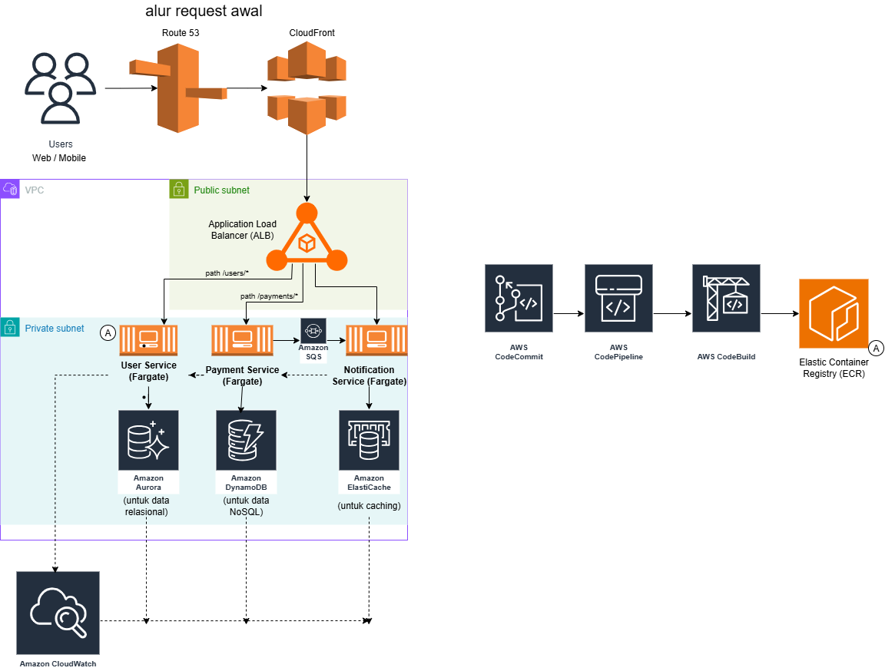
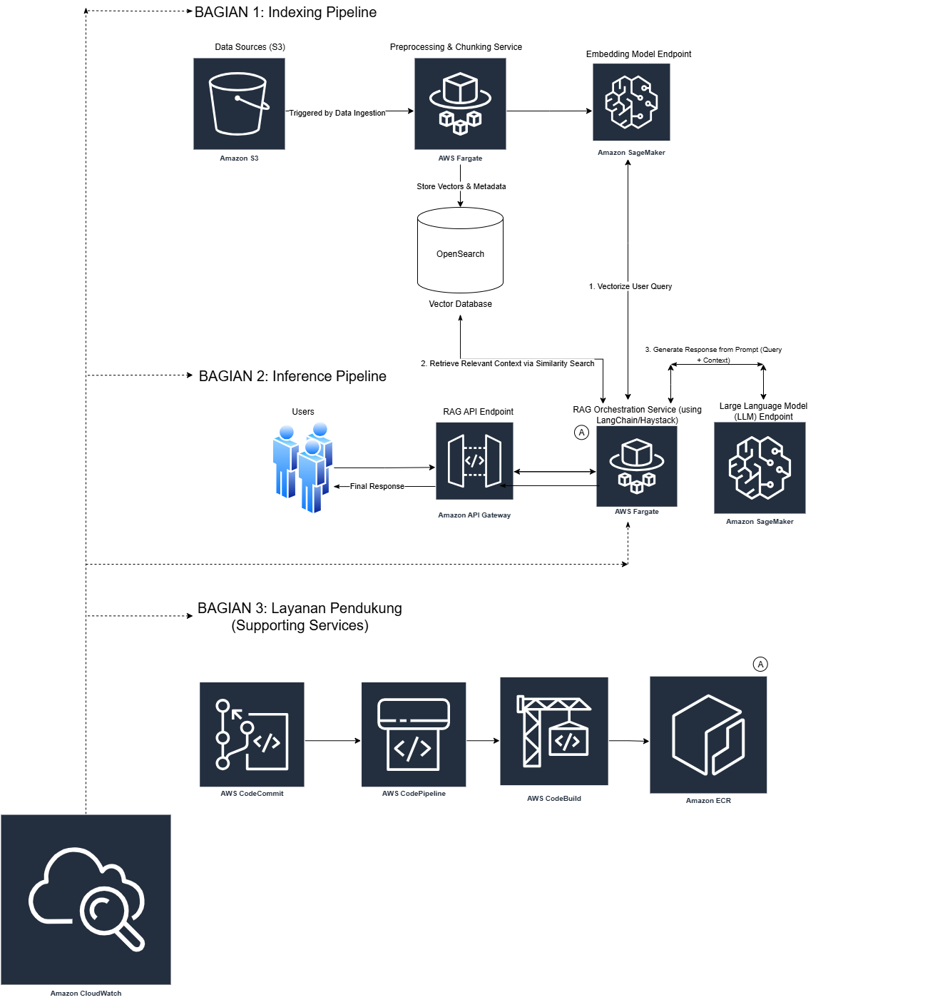

## Cloud Architecture Showcase

A portfolio-friendly collection of cloud architecture case studies and diagrams. Each case study is a production‑minded design with rationale, security posture, and CI/CD strategy, written in a concise, engineering‑report style.

- **Focus**: High‑performance, horizontally scalable, resilient systems with strong observability
- **Vendors**: Starts with AWS; more providers may be added over time

---

### Highlights

- **Case Study 1 – AWS Microservices (ECS on Fargate)**
  - Route 53 → CloudFront → ALB (TLS termination, path‑based routing)
  - Microservices on ECS Fargate (User, Payment, Notification)
  - Polyglot persistence: Aurora (relational), DynamoDB (NoSQL) + ElastiCache
  - Async decoupling via SQS; observability via CloudWatch
  - CI/CD: CodeCommit → CodePipeline → CodeBuild → ECR → ECS

Preview:



- Read the full write‑up: `Arsitektur-Microservices/README.md`
- Diagram source: `Arsitektur-Microservices/Arsitektur-Microservices.drawio.png` (created with diagrams.net/draw.io)

---

- **Case Study 2 – Retrieval‑Augmented Generation (RAG) on AWS (Vendor‑Agnostic)**
  - Ingestion from internal stores (S3/GCS/Azure Blob)
  - Preprocessing & chunking → embeddings → vector database (OpenSearch Vector/Qdrant/Weaviate/Redis Vector)
  - RAG orchestration with LangChain/Haystack; LLM endpoint (SageMaker/Bedrock or OSS self‑hosted)
  - API Gateway front door; ECS Fargate services; CloudWatch observability
  - CI/CD: CodeCommit → CodePipeline → CodeBuild → ECR → ECS; model/prompt versioning

Preview:



- Read the full write‑up: `RAG/README.md`
- Diagram source: `RAG/RAG.drawio.png`

---

### Repository Structure

```
cloud-architecture-showcase/
├─ README.md                        # This file
├─ Arsitektur-Microservices/
│  ├─ README.md                     # Case Study 1: AWS Microservices on ECS Fargate
│  └─ Arsitektur-Microservices.drawio.png  # Diagram (PNG)
└─ rag/
   ├─ README.md                     # Case Study 2: RAG on AWS (vendor-agnostic)
   └─ RAG.drawio.png                # Diagram (PNG)
```

---

### How to Use

- **Browse**: Open each case study’s `README.md` for the narrative, diagrams, and rationale
- **Reuse**: Copy architecture sections (components, rationale, security, CI/CD) as templates for your own projects
- **Export**: Edit diagrams in diagrams.net (or Lucidchart) and export to PNG/SVG for your portfolio or docs

---

### Roadmap

- EKS‑based variant (service mesh, gRPC, canary/blue‑green)
- Serverless variant (API Gateway + Lambda + EventBridge)
- Multi‑Region active/passive with Route 53 ARC and data replication strategies
- Deeper observability with OpenTelemetry and Managed Prometheus/Grafana

---

### Contact

- Maintainer: Muhammad Daffa Haidar Falah
- Feedback and ideas are welcome—open an issue or PR.
