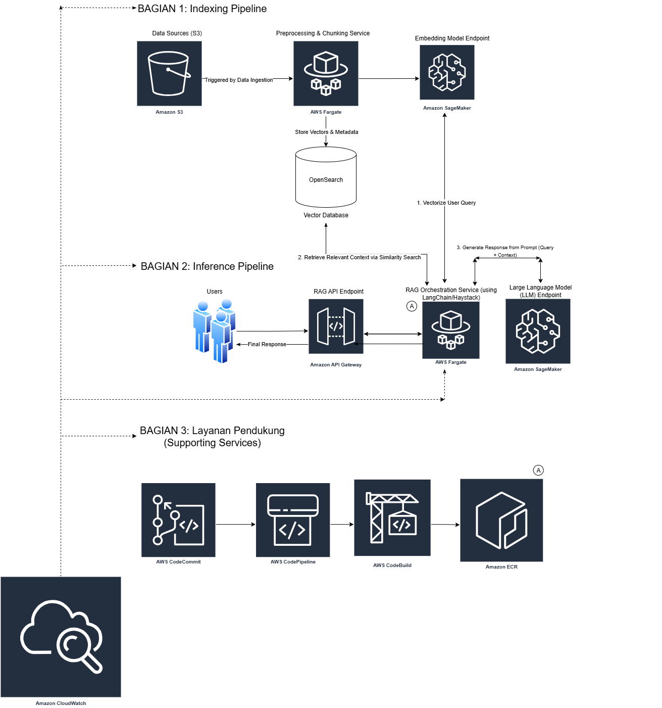

### Case Study 2: Retrieval‑Augmented Generation (RAG) Architecture on AWS (Vendor‑Agnostic Design)

This case study presents a production‑minded RAG architecture that ingests enterprise content, builds searchable vector indexes, and serves grounded answers using an LLM. The design emphasizes portability (vendor‑agnostic choices), scalability, security, and observability.

- Objective: High‑quality grounded responses using internal knowledge
- Scope: Indexing pipeline + inference pipeline + supporting services (CI/CD, monitoring)
- Cloud: AWS reference (portable to GCP/Azure with equivalent services)

---

### Architecture (PNG)

---

### Challenge

DAF is exploring a Retrieval‑Augmented Generation (RAG) system that indexes internal data and answers user queries through an LLM. The platform must ingest from internal sources (e.g., S3/GCS/Azure Blob), perform preprocessing and vector indexing, query a scalable vector database, and orchestrate an LLM for grounded responses. It must be scalable, vendor‑agnostic, support retraining/index refresh, and include strong security and observability.

### Tasks

- High‑fidelity ingestion from internal sources (S3/GCS/Azure Blob/etc.)
- Preprocessing and indexing into a vector database
- Use of LLMs (open‑source preferred, or cloud‑hosted)
- Horizontal scalability and portability across clouds (vendor‑agnostic)
- Support for retraining and index refresh
- Security and observability end‑to‑end

### Deliverables

- RAG architecture diagram (by cloud as needed)
- Component justification (e.g., LangChain/Haystack, Qdrant/Weaviate/Redis Vector/OpenSearch)
- Orchestration approach (Docker, Kubernetes, serverless)
- CI/CD and model/pipeline management plan
- Data security and cost‑optimization strategy

---

### Technical Explanation (Professional Narrative)

To meet these requirements, I designed a layered architecture with two main pipelines—Indexing and Inference—plus supporting CI/CD and observability services.

- Indexing Pipeline

  - Data Sources: Internal documents stored in Amazon S3 (portable to GCS/Azure Blob). New or updated objects trigger ingestion.
  - Preprocessing & Chunking Service (ECS Fargate): Normalizes formats (PDF/HTML/Office), cleans text, chunks content, extracts metadata, and handles PII redaction if needed. Packaged as a container for portability; can run on Kubernetes or serverless as well.
  - Embedding Model Endpoint (Amazon SageMaker): Generates vector embeddings for chunks. Supports hot‑swapping to other providers (Bedrock, Hugging Face Inference Endpoints) or self‑hosted open‑source models (e.g., Instructor, E5) to remain vendor‑agnostic.
  - Vector Database (OpenSearch Vector): Stores vectors and metadata; enables similarity search with filters and access control. Interchangeable with Qdrant, Weaviate, or Redis Vector to meet portability or performance/feature needs.

- Inference Pipeline

  - RAG API Endpoint (Amazon API Gateway): Exposes an authenticated REST interface for query requests from applications.
  - RAG Orchestration Service (ECS Fargate): Implements retrieval and prompt composition using LangChain or Haystack. Steps: vectorize user query → retrieve top‑k context → build grounded prompt → call LLM → return final response with citations.
  - LLM Endpoint (SageMaker): Large Language Model endpoint (can be managed or fine‑tuned). Pluggable to Bedrock, OpenAI, or a self‑hosted OSS model on ECS/EKS/GKE/AKS for full vendor neutrality.

- Supporting Services
  - CI/CD (CodeCommit → CodePipeline → CodeBuild → ECR): Automated build/test for services and pipelines; container images stored in ECR. Deployment to ECS Fargate. Equivalent flows are available on GCP (Cloud Build/Artifact Registry/Cloud Deploy) and Azure (DevOps Pipelines/ACR).
  - Observability (Amazon CloudWatch): Centralized metrics, logs, dashboards, alerts; optional tracing with X‑Ray/OpenTelemetry.

---

### Component Justification

- LangChain / Haystack

  - Provide composable building blocks for retrieval, reranking, prompt templating, and evaluation. LangChain has a broad connector ecosystem; Haystack offers a strong pipeline abstraction and retriever‑generator patterns.

- Vector Store: OpenSearch Vector vs Qdrant vs Weaviate vs Redis Vector

  - OpenSearch Vector: Managed search engine with vector and keyword search, filtering, and enterprise features (IAM, VPC). Good when you already use OpenSearch.
  - Qdrant: High‑performance vector DB with HNSW, payload filtering; easy to self‑host; strong OSS community.
  - Weaviate: Rich schema, hybrid search (BM25+vector), modular; managed and OSS options.
  - Redis Vector: Low‑latency in‑memory vector search and caching; cost‑effective for hot datasets.
  - Choice depends on scale, ops model, hybrid search needs, and ecosystem fit. The design keeps the retriever behind an interface to swap implementations without app rewrites.

- LLM: Open‑source vs Managed

  - Managed (SageMaker/Bedrock): Simpler ops, autoscaling, and GPU abstraction; pay‑as‑you‑go.
  - Open‑source (Mixtral/Llama variants) on ECS/EKS: Full control, tunable cost/perf, and data locality; requires GPU capacity planning.

- Orchestration: Containers (ECS Fargate) first
  - Serverless containers reduce ops overhead; workloads remain portable to Kubernetes (EKS/GKE/AKS) if deeper control or GPU scheduling is required.

---

### CI/CD and MLOps Plan

- Repos: Separate repos for indexing service, RAG service, and prompt/config packages
- Pipelines: Lint, unit/integration tests, security scans (SAST/containers), build/push to ECR, deploy to ECS
- Model/Prompt Management: Version embedding/LLM models and prompt templates; store configs in S3/Parameter Store; use SageMaker Model Registry or MLflow when applicable
- DataOps: Scheduled re‑index jobs and incremental refresh on object change notifications (S3 events)
- Canary/Blue‑Green: Progressive rollout of service versions and prompt/embedding changes with automatic rollback on SLO regressions

---

### Security Strategy

- Network Isolation: Private subnets for services and data; only API Gateway is public
- IAM Least‑Privilege: Task roles per service; scoped access to S3 buckets, vector DB, and model endpoints
- Secrets Management: AWS Secrets Manager for credentials and model keys; rotate automatically
- Encryption: TLS in transit; KMS at rest for S3, OpenSearch/Qdrant volumes, and Secrets
- Data Governance: Tag/classify datasets; optional PII redaction in preprocessing; audit with CloudTrail/Config
- Access Control: Signed requests or OAuth/JWT at API Gateway; per‑tenant filters at retriever layer

---

### Observability

- Metrics: Ingestion throughput, chunking latency, embedding TPS, index size, recall@k, query latency, LLM token usage/cost
- Logs/Traces: Structured logs with correlation IDs; OpenTelemetry/X‑Ray for end‑to‑end tracing
- Dashboards & Alerts: p95/p99 latencies, error rates, saturation; anomaly detection; SLO burn‑rate alerts

---

### Scalability & Portability

- Horizontal scaling of ECS tasks; autoscaling by queue depth and latency
- Sharded vector indexes by domain/tenant; hybrid search (keyword + vector) to improve recall
- Containerized components for lift‑and‑shift across AWS/GCP/Azure; abstraction layers for vector stores and LLM providers
- Batch re‑index and streaming updates to keep knowledge fresh

---

### Cost Optimization

- Use CPU for preprocessing; size GPU only where needed (LLM/embeddings)
- Right‑size instance classes; consider Graviton for price/performance
- Spot/Flexible capacity for stateless workers; lifecycle policies for S3 and ECR
- Cache prompts/responses where safe; reduce context length via smart chunking and reranking
- Choose vector DB tiers wisely (memory vs disk) and archive cold data

---

### Implementation Notes

- IaC via Terraform/CDK to provision networking, ECS services, OpenSearch/Qdrant, SageMaker endpoints, and CI/CD
- Add reranker (e.g., Cohere Rerank, bge‑reranker) if retrieval precision needs improvement
- Add evaluation harness (answer faithfulness/groundedness) to gate deployments
